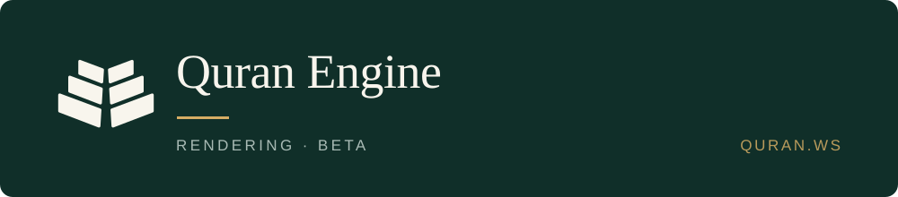

<div align="center">



**SVG does not perform on mobile. This does — the same interactive Mushaf page, as a compact binary, drawn by each platform's own canvas.**

<a href="https://quran.ws/blocks/quran-engine"></a>
<a href="https://quran.ws/docs/reference/quran-engine"></a>

</div>

> محرّكٌ يعرض صفحات المصحف المُفصَّلة على الهاتف بصيغةٍ ثنائيةٍ مُوجَزة، حيث لا يفي الرسم الشعاعي.

| | |
|---|---|
| **Package** | `@quran-ws/engine` · `0.1.0` |
| **Whole mushaf** | 38.9 MB brotli |
| **Wasm engine** | 311 KB |
| **Licence** | MIT (the code) · source bundle terms (the data) |

```sh
# not published — build the wasm, or take it from the release
```

## Where the documentation is

Everything about using it lives on the site. This repository is the source.

| | |
|---|---|
| **Overview and demo** | [quran.ws/blocks/quran-engine](https://quran.ws/blocks/quran-engine) |
| **Reference** | [quran.ws/docs/reference/quran-engine](https://quran.ws/docs/reference/quran-engine) |
| **Make words clickable** | [quran.ws/docs/build/clickable-words](https://quran.ws/docs/build/clickable-words) |
| **Render on iOS, Android, Flutter and React Native** | [quran.ws/docs/build/platforms](https://quran.ws/docs/build/platforms) |
| **Work offline** | [quran.ws/docs/build/offline](https://quran.ws/docs/build/offline) |
| **Licensing in full** | [quran.ws/docs/reference/licensing](https://quran.ws/docs/reference/licensing) |

## What is in here

| | |
|---|---|
| `crates/` | the Rust core: `qvp-format`, `qvp-core`, `qvp-convert`, `qvp-ffi` |
| `packages/` | the thin platform wrappers — iOS, Android, Flutter, React Native |
| `web/` | the reference web harness the browser demo runs on |
| `conformance/` | the gates that must stay green |
| `scripts/` | build and packaging |
| `docs/` | the API, the format, and the measured numbers |

Issues and pull requests are welcome here. Everything that is not about *changing* this repository is on the site.
